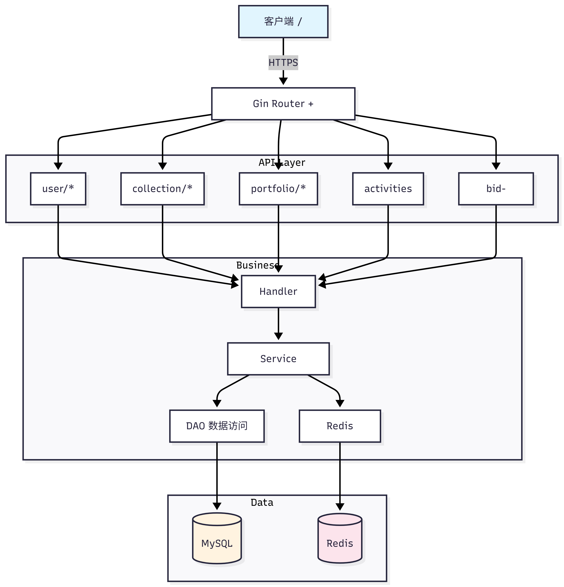
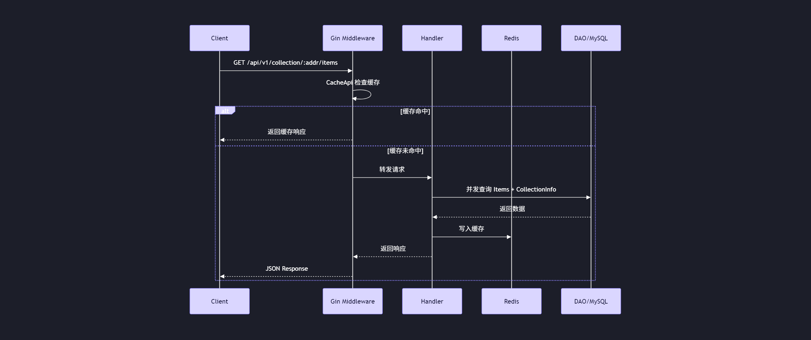

# MiSwap

MiSwap 是一个基于订单簿（Orderbook）模型的去中心化 NFT 交易所（DEX）后端服务。项目采用 Go 语言编写，提供高性能的 RESTful API，支持多链 NFT 集合浏览、用户资产管理、订单簿查询及交易活动追踪等核心功能。

## 技术栈

| 类别 | 技术 | 说明 |
| :--- | :--- | :--- |
| **Web 框架** | Gin | 高性能 HTTP 路由与中间件 |
| **日志** | slog | Go 标准结构化日志库 |
| **数据库** | MySQL | 订单、用户、NFT 元数据持久化存储 |
| **缓存** | Redis | 热点数据缓存、API 响应缓存、签名状态 |
| **配置管理** | Viper / YAML | 配置文件解析与环境变量注入 |

## 系统架构



### 请求处理流程


## API 路由概览

### 用户模块 `/api/v1/user`
- `GET /:address/login-message` — 生成登录签名消息
- `POST /login` — 验证签名并签发 Token
- `GET /:address/sig-status` — 查询用户签名状态

### 集合与 NFT 模块 `/api/v1/collection`
- `GET /:address` — Collection 详情
- `GET /:address/bids` — Collection 级别出价列表
- `GET /:address/:token_id/bids` — 单个 Item 出价列表
- `GET /:address/items` — Collection 下所有 Items
- `GET /:address/:token_id` — Item 详情
- `GET /:address/:token_id/traits` — Item 属性信息
- `GET /:address/top_trait` — Trait 最高价格
- `GET /:address/:token_id/image` — Item 图片（带 60s 缓存）
- `GET /:address/history_sales` — 历史成交记录
- `GET /:address/:token_id/owner` — Item 当前持有者
- `GET /:address/:token_id/metadata` — 刷新 Metadata
- `GET /ranking` — 集合排行榜（带 60s 缓存）

### 资产模块 `/api/v1/portfolio`
- `GET /collections` — 用户多链 Collection 持仓
- `GET /items` — 用户多链 NFT Items
- `GET /listings` — 用户挂单列表
- `GET /bids` — 用户出价列表

### 活动与订单
- `GET /api/v1/activities` — 多链交易活动流
- `GET /api/v1/bid-orders` — 订单簿信息查询

## 快速启动

### 前置要求
- Go 1.25.5
- MySQL 8.x
- Redis 5.x

### 1. 克隆项目

```bash
git clone <repo-url> && cd miswap
```

### 2. 修改配置文件

复制示例配置并按需修改：

```bash
cp config.yaml.example config.yaml
```

需要替换的关键配置项：

```yaml
mysql:
  host: "127.0.0.1"      # ← 替换为实际 MySQL 地址
  port: 3306
  user: "miswap"         # ← 替换为实际用户名
  password: "your_pass"  # ← 替换为实际密码
  database: "miswap_db"  # ← 替换为实际库名

redis:
  host: "127.0.0.1"      # ← 替换为实际 Redis 地址
  port: 6379
  password: ""           # ← 替换为实际密码（如有）
  db: 0

server:
  port: 8080             # ← 服务监听端口
```

### 3. 运行

```bash
go run main.go
```

服务启动后默认监听 `http://localhost:8080`，可通过 `http://localhost:8080/api/v1/collection/ranking` 验证服务是否正常。

### 4. 生产部署（可选）

```bash
go build -o miswap main.go
./miswap
```

建议使用 systemd 或 Docker 进行进程管理，并确保 MySQL 与 Redis 连接信息通过环境变量或挂载配置文件注入，避免敏感信息硬编码。

## 待优化📃
1. 当前项目没有添加生产化的日志工具，没有写入到指定文件并管理。
2. 部分方法，行数过长以至于变成“屎山”代码，需要进行可控的封装。
3. 部分SQL查询方法，没有严格的使用占位符，有SQL注入风险。
4. 项目的配置项没有使用函数选项的方式，目前是固定的传参，不利于后期改动。
这些等后续有时间再更新吧😄，这个先告一段落🎉。
